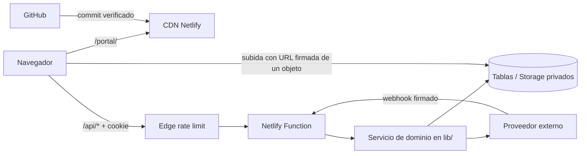

# Arquitectura actual

Robin Platform es un monolito web desplegado en Netlify: una aplicación React/Vite,
Functions Node.js para HTTP y trabajos programados, y dos Edge Functions dedicadas a
limitación de abuso. Esta estructura conserva un único despliegue y fronteras de dominio
en código, sin introducir servicios adicionales durante la limpieza.

## Flujo de una petición

1. Netlify redirige `/` a `/portal/` y sirve el build desde `deploy/portal`.
2. El frontend usa rutas `/api/*` del mismo origen; `netlify.toml` las asigna a Functions.
3. Las rutas protegidas verifican origen, cookie de sesión firmada y autorización backend.
4. La Function orquesta servicios de `lib/`, que realizan validación, reglas de dominio y
   accesos a datos o proveedores.
5. El backend responde JSON/PDF/SSE y aplica `Cache-Control: no-store` a toda la API.

La `SUPABASE_SERVICE_ROLE_KEY` solo existe en el runtime servidor. El navegador únicamente
contacta el Storage del proyecto autorizado para subir un objeto a una URL firmada, temporal
y emitida por el backend; no recibe claves ni acceso general a Supabase. El último snapshot
conocido muestra RLS activo, pero no incluye el detalle de sus políticas; la barrera efectiva
del cliente de servidor se encuentra en cada Function. Véanse
[DATABASE_CURRENT.md](DATABASE_CURRENT.md) y [AUTHORIZATION.md](AUTHORIZATION.md).

## Capas

| Capa | Ubicación | Responsabilidad |
|---|---|---|
| Configuración de despliegue | `netlify.toml`, `.github/workflows/ci.yml` | Build, rutas, headers, schedules y gates |
| Protección Edge | `netlify/edge-functions/` | Rate limits previos a las Functions |
| Interfaz HTTP | `netlify/functions/` | Método, origen, sesión, autorización y respuesta |
| Dominio e integraciones | `lib/` | Reglas, orquestación y adaptadores de proveedores |
| Reglas compartidas | `shared/` | Contrato, importes y contraseña reutilizables |
| Frontend | `portal-source/src/` | Portales React de alumnos y administración |
| Evidencia y gates | `test/`, `scripts/`, documentación | Regresión, inventarios y controles estáticos |

## Dominios

- **Identidad**: cookie JWT firmada y una raíz persistente `users` para alumnos/admins.
  No se usa Supabase Auth como identidad de aplicación.
- **Aplicación**: onboarding, expediente, carreras, documentos, pagos, reservas y chat.
- **Administración**: vistas y acciones para advisors y admins de aplicación.
- **Integraciones**: Stripe/Revolut, Google, Holded, Resend, Anthropic y webhooks autenticados.

Los entrypoints conservan los detalles HTTP y delegan lógica reutilizable a `lib/`.
[API_INVENTORY.md](API_INVENTORY.md) enumera todas las Functions y
[FILE_MAP.md](FILE_MAP.md) localiza cada módulo.

Las Functions tienen un límite CI uniforme de 220 líneas físicas.

## Datos y archivos

Las tablas de aplicación residen en `public`; los buckets privados vigentes son
`dni-uploads` y `documents`. Las descargas se sirven mediante backend o URLs firmadas.
Las subidas académicas y de identidad usan tickets firmados de un solo destino para que el
binario no atraviese el límite de payload de Netlify; el backend valida ownership, ruta,
MIME y tamaño antes de guardar metadata o entregar la imagen al OCR.
`webhook_log` registra eventos operativos y también la cola de reintentos idempotentes.
No debe habilitarse acceso público/permanente desde navegador ni añadirse una migración
sin diseñar primero políticas y un rollback explícito.

## Build y despliegue

GitHub es la fuente versionada. CI instala ambos lockfiles, ejecuta gates y construye el
frontend. Netlify ejecuta su build desde el commit, copia `portal-source/dist` a
`deploy/portal` y despliega Functions/Edge Functions junto al estático. `deploy/` y
`node_modules/` son artefactos regenerables y no se versionan.

Decisiones más detalladas: [FRONTEND_ARCHITECTURE.md](FRONTEND_ARCHITECTURE.md),
[BACKEND_ARCHITECTURE.md](BACKEND_ARCHITECTURE.md),
[IDENTITY_MODEL.md](IDENTITY_MODEL.md) y [OPERATIONS.md](OPERATIONS.md).

Para bajar desde estas capas hasta cada carpeta y archivo concreto, usa el
[árbol navegable del repositorio](codebase/README.md).
